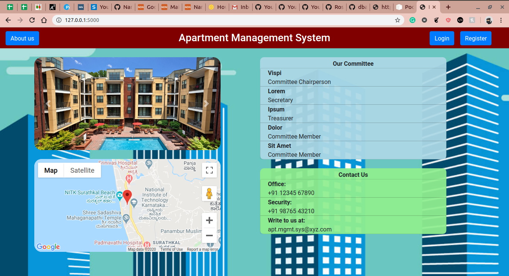
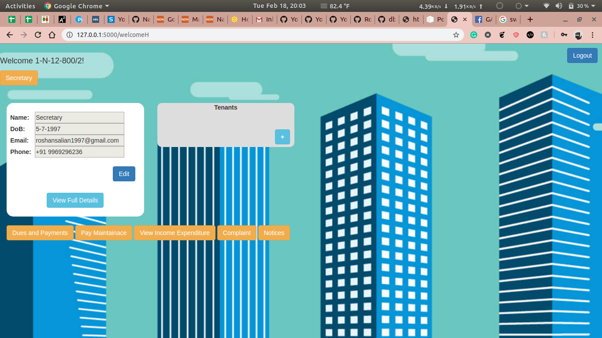
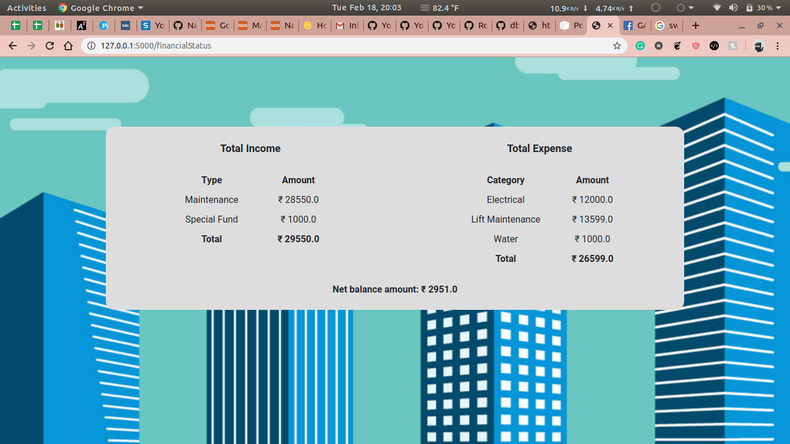
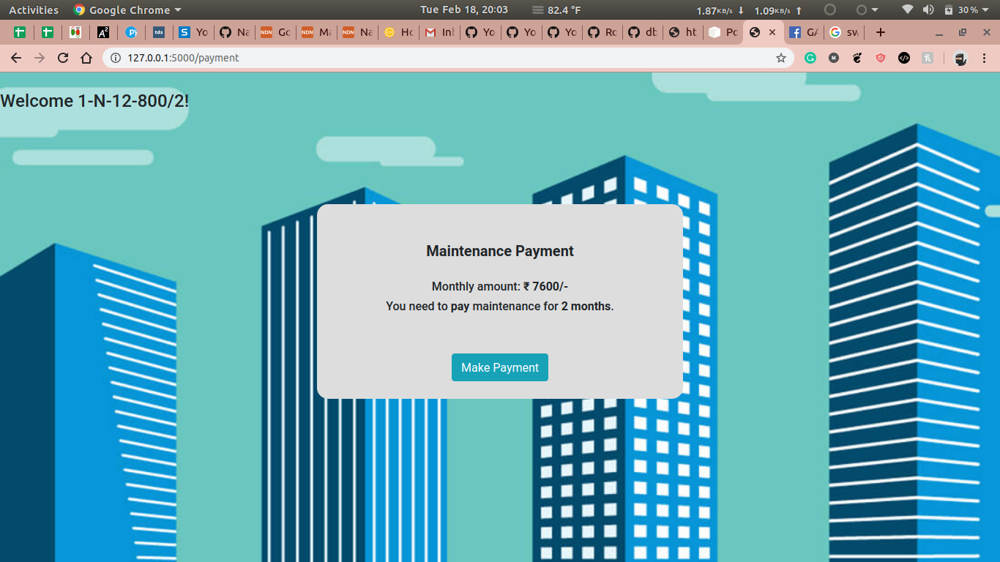

# Apartment Management System 
> Website to automate manual appartment works using Flask in backend.

The Website has 5 main stakeholder, President, Secretary, Treasurer, Committee member and residents. Manual works like making record of bill payment, expenses incurreded, notices, making complaints, etc. can be made using the website.






## Installation
```sh
$ pip install -U Flask
```

## Usage
```sh
$ python script.py
```
